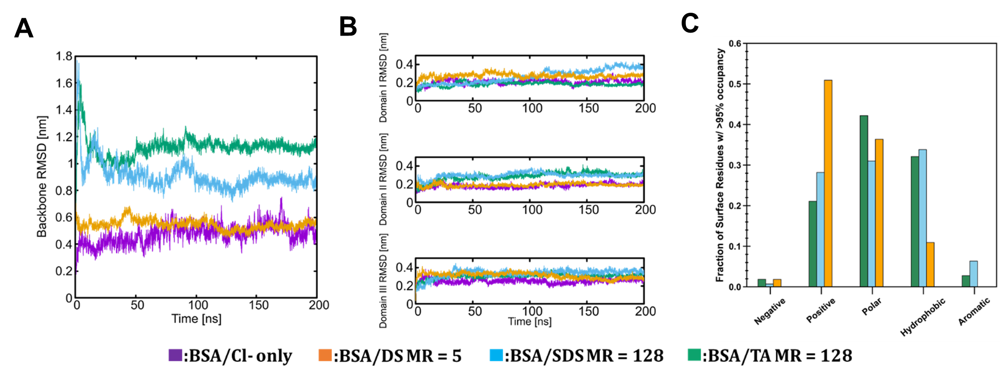

## Public Github Repository for the following July 23, 2021 publication
### Title: Formulation and Efficacy of Catalase-Loaded Nanoparticles for the Treatment of Neonatal Hypoxic-Ischemic Encephalopathy
### Link to publication found [here](https://www.mdpi.com/1999-4923/13/8/1131)

This repository contains the necessary MD simulation files and in-house scripts used to setup and analyze simulation discussed in the aforementioned study

Directory Structure:

* analysis_jpntbs

  - Contains saved dictionaries of residues occupancy(.json), python file containing analysis functions and jupyter notebook containing plot generation

* fully_equil_starting_config

  Directory structure

    * BSA_DS_MR_5
      - NPT equilibration GROMACS version 2020.5 files of starting config. necessary to perform MD production run 
    * BSA_SDS_MR_128
      - NPT equilibration GROMACS version 2020.5 files of starting config. necessary to perform MD production run
    * BSA_TA_MR_128
      - NPT equilibration GROMACS version 2020.5 files of starting config. necessary to perform MD production run
    * amber99sb-star-ildnp.ff
      - Protein forcefield files for GROMACS
    * setup_bash_scripts
      - Bash scripts used for simulation setup, equilibration and job submissions 

* mdp_files

  - GROMACS parameter files used for e-min, nvt and npt equilibration, scaling and production runs. 

* pdb_and_itp_files

  - Pdb and topology files for 12-mer Dextran Sulphate, Sodium Dodecyl Sulphate (SDS) and Taurocholic Acid (TA) 

* rmsd_data 

  - Root mean squared deviation data of BSA backbone and its respective domains 

Google drive directory with trajectory files analyzed in this study found [here](https://drive.google.com/drive/folders/1abH51stjlG8bNIKShnhV1s_4hlJH9Xai?usp=sharing) 

Main figure generated:

 
